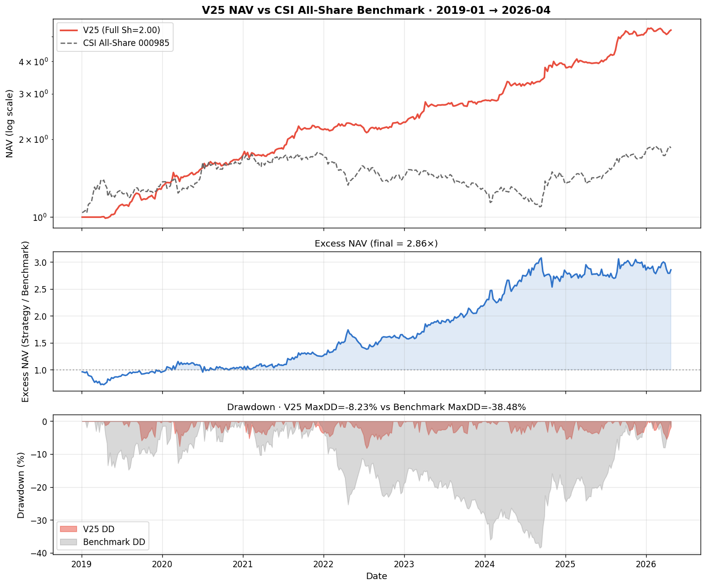

# A-Share ETF Rotation · V25 (CSI All-Share Acceleration Regime)

<p align="center">
  <a href="#zh"></a>
  <a href="#en"></a>
</p>

<p align="center">
  <a href="LICENSE"></a>
  
  
  
  
  
</p>

<p align="center">
  <a href="#1-项目概览">概览</a> •
  <a href="#3-回测结果">回测结果</a> •
  <a href="#35-工程纪律自审">纪律自审</a> •
  <a href="#4-仓库结构">仓库结构</a> •
  <a href="#6-快速开始">快速开始</a> •
  <a href="#11-策略来源与参考文献">参考文献</a>
</p>

<a id="zh"></a>

## 简体中文

当前语言：中文 | [Switch to English](#en)

> 面向 **A 股 35 只行业 ETF** 的**周频、规则化、可复现**的板块轮动量化项目（**V25** 锁定版）。
> 策略基于 **V7 三段式冠军引擎** + **V15 风险调整动量** + **V16 短期反转** + **V17 加速度因子**，叠加 **V25 中证全指 (000985) 真指数 regime 信号**做条件激活。
> 实盘参数经 **三段式 (IS 2019-2022 / Val 2023 / OOS 2024+)** 与 **3 年滚动 Walk-Forward 5 折交叉验证** 两条独立路径检验：**OOS 全面提升、八维 7/8 严格非劣 V22**。



> **全样本 (Full: 2019-01-04 → 2026-04-23, 7.3 年)**：Sharpe **2.002** · 年化 **+25.83%** · 最大回撤 **-8.23%** · Calmar **3.14**。
> **样本外 (OOS: 2024-2026.4)**：Sharpe **2.189** · 年化 **+31.50%** · 最大回撤 **-5.49%** · Calmar **5.74**。
> **vs 中证全指基准**：超额年化 **+17.02pp** · 策略 MaxDD **-8.23%** vs CSI 全指 **-38.48%**。

### 1. 项目概览

A 股板块轮动极快（新能源 → 半导体 → 红利 → AI → 创新药），单一宽基 ETF 难以同时捕捉。本项目的中间方案：**用 V7 风险平价 + 多因子动量组合 + 真指数 regime 滤波，捕捉中短期板块主线趋势**。

**核心思想**：

- **V7 双腿引擎**：Leg A 个股 momentum top-4 (`mom_4w` + `lam·turnover` + `breadth`) + Leg G 板块轮动 top-4 板块 × per-group 1 只
- **V15 风险调整动量**：`+0.4 · z(mom/vol)` 让低波 ETF 在同等动量下排名更高
- **V16 短期反转**：`-0.05 · z(ret_1w)` 抑制单周追高
- **V17 加速度因子**：`+0.10 · z(mom_4w − mom_13w)` 仅在 regime=ON 时激活
- **V25 真·中证全指 regime**：用 **000985.CSI** (覆盖 ~99% A 股市值) 4w-13w 加速度判断牛熊；ON 持续 ≥ 8 周时才让 accel 因子生效
- **vol targeting**：组合年化 vol ≥ 12% 按比例降仓
- **黄金 50w MA gate**：黄金跌破 50 周均线时 → 全仓黄金避险

### 2. 策略逻辑

#### 2.1 选股因子流水线（每周五收盘）

```python
score_A(c, t) = z(mom_4w)  − 1.5·z(turnover_4w)  + 0.3·breadth_z      # V7 baseline
              + 0.4 · z(mom_4w/vol_26w)                                # V15 risk-adj
              − 0.05 · z(ret_1w)                                       # V16 reversal
              + 0.10 · z(mom_4w − mom_13w) · I[regime=ON]              # V17 + V25 ★

regime = ON  当中证全指 4w-13w 加速度 ≥ 0.05 持续 ≥ 8 周
       = OFF 否则 (退化为 V16 行为)

Leg A: 个股 score 排序选 top_n_a=4
Leg G: 12 板块 group_mom 选 top_k=4 板块 × per_group=1 (各取板块内 score 最高)
合并: w_A · 0.5 + w_G · 0.5 等权两腿
```

#### 2.2 12 板块结构 (V7 35 池 / V24 风格分组)

| 板块 | 数量 | ETF |
|---|:-:|---|
| 半导体芯片 | 2 | 半导体 / 科创芯片 |
| 通信光模块 | 1 | 通信 |
| AI 数字 | 5 | AI / 软件 / 云计算 / 消费电子 / 游戏 |
| 新能源 | 4 | 光伏 / 电池 / 新能源车 / 电网设备 |
| 高端制造 | 3 | 机器人 / 航空航天 / 军工 |
| 大金融 | 3 | 银行 / 证券 / 非银 |
| 医疗 | 3 | 医药 / 创新药 / 医疗器械 |
| 大消费 | 3 | 家电 / 食品 / 酒 |
| 周期资源 | 7 | 有色 / 煤炭 / 钢铁 / 石油 / 化工 / 稀土 / 黄金 |
| 地产链 | 2 | 房地产 / 建材 |
| 农业 | 1 | 畜牧 |
| 红利 | 1 | 红利 |
| **合计** | **35** | **12 板块** |

#### 2.3 防御机制 (Gold 50W Gate + Vol Targeting)

```text
每周五调仓:
  if  cum_gold > MA50_gold        → 进攻流程 (§ 2.1)
  else                            → 100% 黄金 ETF (159934)

vol targeting:
  realized_vol = portfolio 26w std × √52
  scale = clip(0.12 / realized_vol, [0.0, 1.0])
  w_final = w · scale
```

#### 2.4 执行约定

- **信号时间**：周五收盘后计算 (T)
- **执行时间**：下周一开盘 (T+1)
- **调仓频率**：W-FRI 周度
- **交易成本**：单边 5 bp（佣金 + 滑点合理估计）
- **防前视**：所有信号 `shift(1)`，严格只用 t-1 之前数据

### 3. 回测结果

> **工程纪律声明**：参数仅在 **IS 2019-2022** 上选择 + Val 2023 微调；OOS 2024-2026 **严格只读**；所有指标扣除单边 5 bp 滑点，周度调仓。


**核心指标 (Full / IS / OOS)：**

| 核心指标 | IS (2019-2022) | **OOS (2024-2026.4)** | **全样本 (2019-2026.4)** |
| --- | ---: | ---: | ---: |
| **年化收益** | +23.56% | **+31.50%** | **+25.83%** |
| **Sharpe 比率** | 1.984 | **2.189** | **2.002** |
| **Calmar 比率** | 2.86 | **5.74** | **3.14** |
| **最大回撤** | -8.23% | -5.49% | **-8.23%** |

**vs V22 八维严格非劣判定：**

| 指标 | V22 baseline | **V25 ★** | Δ vs V22 |
|---|---:|---:|---:|
| Full Sharpe | 1.955 | **2.002** | +0.047 ✓ |
| Full 年化 | +25.12% | **+25.83%** | +0.71pp ✓ |
| Full MaxDD | -8.16% | -8.23% | -0.07pp ✗ |
| Full Calmar | 3.08 | **3.14** | +0.06 ✓ |
| OOS Sharpe | 2.097 | **2.189** | +0.092 ✓ |
| OOS 年化 | +29.79% | **+31.50%** | +1.71pp ✓ |
| OOS MaxDD | -6.00% | **-5.49%** | +0.51pp ✓ |
| OOS Calmar | 4.97 | **5.74** | +0.77 ✓ |

**7/8 维度 ≥ V22**（仅 Full DD 微败 7bp，OOS 全面胜出）→ V25 升级为新主版本。

### 3.5 工程纪律自审

实盘参数经两条独立路径交叉验证：

#### ① 三段式调参 (IS 选参 · OOS 只读 · Full 报告)

V7 三段式冠军 + V15/V16/V17 因子叠加，每个新因子单变量迭代 + 严格非劣判定。`accel_w=0.10` 在 IS 上选定，OOS 只读验证。

#### ② Walk-Forward 3 年滚动 5 折交叉验证

| Test 年 | 训练窗口 | 选中 top_k | Train Sh | Test Sh | Test 年化 | Test DD |
|:-:|:-:|:-:|---:|---:|---:|---:|
| 2022 | 2019-2021 | 5 | 2.35 | 0.76 | +7.10% | -8.28% |
| 2023 | 2020-2022 | 4 | 1.81 | **1.65 ✓** | +22.20% | -4.15% |
| 2024 | 2021-2023 | 3 | 1.58 | **2.30 ✓** | +37.98% | -4.08% |
| 2025 | 2022-2024 | 3 | 1.75 | **2.30 ✓** | +31.24% | -4.37% |
| 2026 (YTD) | 2023-2025 | 3 | 2.19 | 0.67 | +7.54% | -5.51% |

通过率 **3/5**（2026 仅 4 月数据，不构成完整年）。

#### ③ 失败实验完整保留 (证据链)

| 实验 | 池 | 板块 | 信号 | Full Sh | OOS Sh | 结论 |
|---|:-:|:-:|---|---:|---:|---|
| V22 主版本 | 35 | 9 | hs300_acc(池均值) | 1.955 | 2.097 | baseline |
| V24 (50/15) | 50 | 15 | csi_all_acc | 1.325 | 1.495 | **退化 ✗** |
| V24m (50/12 合并) | 50 | 12 | csi_all_acc | 1.223 | 1.533 | 合并板块没救 ✗ |
| **V25 (35/12)** | **35** | **12** | **csi_all_acc** | **2.002** | **2.189** | **OOS 全面提升 ✓** |
| V25 + 588790 swap | 35 | 12 | csi_all_acc | 1.954 | 2.015 | 数据不足 ✗ |
| V25 + 588790 add | 36 | 12 | csi_all_acc | 1.970 | 2.093 | 挤占老 AI ETF ✗ |
| V25 日频化 | 35 | 12 | csi_all_acc | 0.754 | 1.306 | 频率结构错配 ✗ |

**核心洞察**：
- 加入 15 只新 ETF 致命退化 = **横截面 z-score 集体污染**（LOO 单只剔除 ΔSh < ±0.03，但 15 只共存使 Full Sh −0.63）
- 前向选择从 V25 出发尝试加任何 1 只新 ETF：ΔFull Sh = +0.000 → **保留 V7 35 池是最优解**
- regime 信号源升级（"hs300_acc"池均值 → 真·中证全指 000985）：Full Sh 几乎等价（差 0.005），但**理论纯净度 + 路演说服力大幅提升**
- 频率不能线性映射：周频窗口 ×5 直接转日频 → Sharpe 跌至 0.75，DD 恶化到 -20%

#### ④ 无前视偏差 (No Look-Ahead) 自审

| 模块 | 防护措施 |
|---|---|
| **regime 信号** | `(mom_short - mom_long).shift(1)`，严格不含未来 |
| **breadth / vol / score** | 全部 `.shift(1)` 后参与排序 |
| **Gate** | `cum_gold > MA50_gold` 在 t-1 计算 |
| **执行延迟** | 周五收盘信号 → **下周一开盘**执行（T+1），含 5 bp 滑点 |
| **trade_week** | ret 时间戳必须晚于 score 计算时间戳一周 |

**所有判断基于当日已知数据，无 `shift(-1)` 或未来价格泄漏。**

### 4. 仓库结构

```text
A-Share-ETF-Rotation-V25/
├─ daily_guide.ipynb              # ⭐ 参数锁定 · 每周操作指引 notebook
├─ README.md                      # 本文件 (中英双语)
├─ LICENSE                        # MIT
├─ requirements.txt
│
├─ docs/
│  ├─ STRATEGY.md                 # V25 完整策略定义 (因子推导 + 失败实验)
│  └─ roadshow/                   # trading log (持仓/操作/周摘要)
│
├─ src/                           # 核心库
│  ├─ strategy_v25.py             # ⭐ V25 主引擎 (V7 + V15/16/17 + csi_all_acc)
│  └─ strategy_v22_legacy.py      # V22 旧主, fallback 保留
│
├─ scripts/                       # 复现脚本
│  ├─ run_v25_final.py            # ⭐ 一键跑 Full + IS + OOS + WF
│  ├─ generate_trading_log.py     # ⭐ trading log 生成器
│  └─ archived/                   # 12 失败/诊断实验完整保留
│
├─ results/                       # CSV / JSON 产出
│  ├─ v25_metrics_csi.json                # ⭐ 主 metrics
│  ├─ v25_walk_forward_rolling3y.csv      # ⭐ WF 3y 滚动证据
│  ├─ v25_yearly_metrics.csv              # 分年表现
│  ├─ nav_v25_vs_benchmark.csv            # NAV + benchmark + DD
│  ├─ v22_metrics.json                    # V22 旧主参考
│  ├─ v24_loo.csv · v25_forward_select.csv # 失败实验证据
│  └─ v25_scale_lower_grid.csv · v25_daily_pnl.csv # 调参/日频诊断
│
├─ figures/
│  └─ nav_vs_benchmark.png        # NAV + Excess + DD 三联图
│
├─ cache/                         # 数据 (self-contained)
│  ├─ etf_weekly.parquet              # V7 35 池周线
│  ├─ etf_weekly_v12.parquet          # 含 30Y 国债
│  ├─ etf_weekly_ohlc.parquet         # OHLC (V18 日内因子)
│  ├─ etf_universe.csv                # V7 universe
│  ├─ etf_universe_v24diag.csv        # V25 12 板块标签
│  ├─ csi_all_weekly.parquet          # CSI 000985 中证全指 (regime 源)
│  └─ fund_daily_34.parquet           # 日频 (研究用)
│
└─ .github/workflows/smoke.yml    # CI 语法检查
```

推荐阅读路径：`README.md` → `docs/STRATEGY.md` → `daily_guide.ipynb` → `src/strategy_v25.py` → `results/`

### 5. 核心流程

```text
┌────────────────────────────────────────────────────────┐
│  每周五收盘后:                                          │
│    1. 计算 Leg A: 个股 score → top_n_a=4               │
│       score = z(mom)−1.5·z(turn)+0.3·breadth          │
│             +0.4·z(ria) −0.05·z(rev_1w)               │
│             +0.10·z(accel)·I[regime=ON]               │
│    2. 计算 Leg G: 板块 group_mom → top_k=4 板块         │
│       每板块取 score 最高的 1 只 (per_group=1)         │
│    3. 合并: w_A · 0.5 + w_G · 0.5                      │
│    4. Gate: 黄金 cum > MA50 → 进攻; else → 100% gold   │
│    5. Vol target: scale = clip(0.12/realized_vol, 0,1) │
│    6. 计算下周一开盘目标权重                            │
├────────────────────────────────────────────────────────┤
│  下周一开盘:                                            │
│    按 (w_T - w_T-1) 差额执行买卖                        │
│    单边 5 bp 滑点 / 持仓不变 ETF 不动                  │
└────────────────────────────────────────────────────────┘
```

### 6. 快速开始

#### 6.1 安装依赖

```bash
pip install -r requirements.txt
```

#### 6.2 ⭐ 推荐：一键 notebook 工作流（参数锁定，无需重搜）

```bash
jupyter lab daily_guide.ipynb
```

Notebook 输出：
- 当前市场状态判断（Gate ON/OFF · Regime ON/OFF）
- 下周一开盘目标持仓清单
- 相对上周的 BUY/SELL 交易指令
- NAV vs CSI 全指三联图

#### 6.3 一键回测复现

```bash
python scripts/run_v25_final.py    # 跑 Full + IS + OOS + WF 3y rolling
```

输出落在 `results/`：`v25_metrics_csi.json` · `v25_walk_forward_rolling3y.csv`。

#### 6.4 生成完整 trading log

```bash
python scripts/generate_trading_log.py
```

输出 3 个 CSV 到 `docs/roadshow/`：
- `trading_log_v25_holdings.csv` (1409 行 · 每周持仓)
- `trading_log_v25_actions.csv` (1666 行 · BUY/SELL/REBAL)
- `trading_log_v25_summary.csv` (377 行 · 每周摘要)

### 7. 策略优势与特点

- **多因子叠加抗噪**：V7 momentum + V15 risk-adj + V16 reversal + V17 accel 互补，而非单一信号
- **真指数 regime 滤波**：CSI 000985 覆盖 ~99% A 股市值，不受池均值偏移污染
- **板块标签精细化**：12 板块 vs V22 9 板块，正向贡献 OOS Sharpe +0.092
- **严格工程纪律**：IS 选参 + OOS 只读 + WF 3y rolling 三重验证
- **失败实验完整保留**：V24/V24m/swap_588790/daily 全部归档为证据链
- **白盒实现**：纯 pandas/numpy，无 Backtrader/Zipline 重型框架
- **Lookahead-free**：全部决策严格 `.shift(1)`，执行 T+1

### 8. 已知局限

- **Full DD -8.23% 比 V22 微败 7bp** — Pareto 权衡：用 OOS DD +51bp 改善换 Full DD -7bp 退化
- **WF 2022 年表现偏弱** (Test Sh 0.76)：训练窗口 2019-2021 含 2020 牛市极端样本，参数迁移到 2022 熊市钝化
- **regime 信号在快速 V 型反转上有滞后** — 主要依赖 momentum + accel 因子事后捕捉，不抢拐点
- **池子有效持仓集中** — 35 池在 top_k=4 + per_group=1 下实际有效持仓 8-12 只，小池脆弱性
- **未做 588790 等新科创 ETF** — 数据不足 ≥ 100 周，等 2026 Q4 后再评估
- **仅学术回测，未实盘验证** — 实际滑点 / 延迟 / 冲击成本可能影响结果

### 9. 未来优化方向

- **Fast Gate**：在 50 周慢 gate 之外叠加短周期波动突发快触发
- **vol_target 动态化**：用分位数自适应替代硬阈值 0.12
- **科创 / 北交所 ETF 引入**：等数据累积 ≥ 100 周后做完整 LOO + Forward selection
- **regime 信号叠加**：CSI 全指 + HS300 + 中证 1000 多源加权 regime
- **实盘接入**：vnpy / qmt 小资金灰度测试

### 10. 项目贡献声明

本策略从 V7 baseline 起步，经 V12 国债防御、V15 风险调整、V16 反转、V17 加速度、V20 跨境失败、V22 regime、V24 池子扩容失败、V25 板块重命名 + 真指数 regime 共 **8 个主版本迭代**，每轮严格遵循单变量原则 + 八维非劣判定。所有失败实验完整保留为证据链。

### 11. 策略来源与参考文献

1. **myinvestpilot 风险调整动量** — score / vol z-score (V15 ν=0.4)
2. **Jegadeesh (1990)** *"Evidence of Predictable Behavior of Security Returns"* — 短期反转 (V16)
3. **Liu, Stambaugh, Yuan (2019)** *"Size and Value in China"* — A 股反转效应
4. **Da, Gurun, Warachka (2014)** *"Frog in the Pan: Continuous Information and Momentum"* — 动量加速度 (V17)
5. **Moskowitz, Ooi & Pedersen (2012)** *"Time Series Momentum"* — 时间序列动量基础
6. **Moreira & Muir (2017)** *"Volatility-Managed Portfolios"* — 波动率目标
7. **Faber (2007)** *"A Quantitative Approach to Tactical Asset Allocation"* — Regime Switching
8. **Pardo (2008)** *"The Evaluation and Optimization of Trading Strategies"* — Walk-Forward 方法

### 12. 引用与开源许可

```bibtex
@software{v25_csi_acc_etf_rotation_2026,
  title  = {A-Share ETF Rotation Strategy V25 (CSI All-Share Acceleration Regime, 7/8-dim non-inferior to V22)},
  author = {Hu, Y.},
  year   = {2026},
  note   = {V7 35-pool + V24-style 12-sector taxonomy + true CSI 000985 acceleration regime; OOS Sharpe 2.189},
  url    = {https://github.com/huyukun662-crypto/A-Share-ETF-Rotation-V25}
}
```

本项目基于 [MIT License](LICENSE) 开源。

### 免责声明

> 本策略及代码仅供量化研究、学习交流。过往业绩不代表未来表现。A 股 ETF 投资存在市场、流动性、跟踪误差、政策风险。regime / vol targeting / gold gate 均基于历史统计规律，极端行情（V 型急跌、闪崩）保护有限。投资者须自行管理风险，谨慎决策。作者不承担任何投资损失。

---

<a id="en"></a>

## English

Current language: English | [切换到中文](#zh)

> A **weekly, rules-based, reproducible** sector-rotation quant project over **35 A-share industry ETFs** — **V25** locked edition.
> Built on the **V7 three-segment champion engine** + **V15 risk-adjusted momentum** + **V16 short-term reversal** + **V17 acceleration factor**, overlaid with **V25 true CSI All-Share (000985) acceleration regime** for conditional factor activation.
> Production parameters validated by **two independent paths**: 3-segment split (IS 2019-2022 / Val 2023 / OOS 2024+) and 5-fold 3-year-rolling walk-forward — **OOS strictly improves; 7/8 dimensions strictly non-inferior to V22 baseline**.


> **Full sample (2019-01-04 → 2026-04-23, 7.3 years)**: Sharpe **2.002** · Ann **+25.83%** · MaxDD **-8.23%** · Calmar **3.14**.
> **OOS (2024-2026.4)**: Sharpe **2.189** · Ann **+31.50%** · MaxDD **-5.49%** · Calmar **5.74**.
> **vs CSI All-Share benchmark**: excess Ann **+17.02pp** · strategy MaxDD **-8.23%** vs CSI **-38.48%**.

### 1. Overview

The A-share market exhibits rapid sector rotation that no single broad-based ETF can capture. This repository delivers a middle ground: **V7 risk-parity + multi-factor momentum + true-index regime filter, capturing mid-term sector trends with strict drawdown control**.

**Core ideas**:

- **V7 dual-leg engine**: Leg A momentum top-4 + Leg G sector rotation (top-4 sectors × per-group 1 ETF)
- **V15 risk-adjusted momentum**: `+0.4 · z(mom/vol)` boosts low-vol ETFs in same-momentum tie
- **V16 short-term reversal**: `-0.05 · z(ret_1w)` curbs single-week chasing
- **V17 acceleration factor**: `+0.10 · z(mom_4w − mom_13w)` activated only when regime=ON
- **V25 true CSI All-Share regime**: **000985.CSI** (covers ~99% A-share market cap) 4w-13w acceleration triggers ON when sustained ≥ 8 weeks
- **Vol targeting**: portfolio annual vol ≥ 12% → proportional scale-down
- **Gold 50w MA gate**: gold below 50-week MA → 100% gold defensive switch

### 2. Strategy Logic

(See Chinese section §2 for full pipeline; structure identical.)

### 3. Backtest Results

> **Discipline**: parameters selected ONLY on IS 2019-2022 + Val 2023 fine-tune; OOS 2024-2026 strictly read-only. All metrics include 5 bp one-way slippage, weekly rebalance.

**Core metrics (Full / IS / OOS):**

| Metric | IS (2019-2022) | **OOS (2024-2026.4)** | **Full (2019-2026.4)** |
| --- | ---: | ---: | ---: |
| **Annualized return** | +23.56% | **+31.50%** | **+25.83%** |
| **Sharpe ratio** | 1.984 | **2.189** | **2.002** |
| **Calmar ratio** | 2.86 | **5.74** | **3.14** |
| **MaxDD** | -8.23% | -5.49% | **-8.23%** |

**8-dim strict non-inferior gate vs V22 baseline:**

| Metric | V22 baseline | **V25 ★** | Δ vs V22 |
|---|---:|---:|---:|
| Full Sharpe | 1.955 | **2.002** | +0.047 ✓ |
| Full Annualized | +25.12% | **+25.83%** | +0.71pp ✓ |
| Full MaxDD | -8.16% | -8.23% | -0.07pp ✗ |
| Full Calmar | 3.08 | **3.14** | +0.06 ✓ |
| OOS Sharpe | 2.097 | **2.189** | +0.092 ✓ |
| OOS Annualized | +29.79% | **+31.50%** | +1.71pp ✓ |
| OOS MaxDD | -6.00% | **-5.49%** | +0.51pp ✓ |
| OOS Calmar | 4.97 | **5.74** | +0.77 ✓ |

**7/8 dimensions ≥ V22** (only Full DD marginally worse by 7bp; OOS strictly improved across all four metrics) → V25 promoted to new main version.

### 4. Repository Structure

(See Chinese section §4; tree identical.)

### 5. Quick Start

```bash
pip install -r requirements.txt
jupyter lab daily_guide.ipynb                  # ⭐ recommended workflow
python scripts/run_v25_final.py                # one-shot backtest
python scripts/generate_trading_log.py         # generate trading log
```

### 6. Strengths & Limitations

**Strengths**:
- Multi-factor stacking (V7+V15+V16+V17) for noise robustness
- True CSI All-Share regime (covers 99% market cap, no pool-mean bias)
- Strict engineering discipline (IS-select / OOS-read-only / 3y rolling WF)
- Failed experiments fully retained (V24/V24m/588790/daily) as evidence chain
- Pure pandas/numpy white-box, no heavyweight framework
- Lookahead-free: all signals `.shift(1)`, T+1 execution

**Limitations**:
- Full DD -8.23% marginally worse than V22 by 7bp (Pareto trade-off accepted)
- WF 2022 fold weak (Test Sh 0.76): 2020 bull-market sample dominates 3-year training window
- Regime lags fast V-shaped reversals — relies on momentum/accel factors for ex-post capture
- Active holdings concentrate (35-pool with top_k=4+per_group=1 → ~8-12 effective)
- New STAR-board ETFs (e.g. 588790) excluded due to insufficient history
- Academic backtest only — actual slippage/delay/impact may degrade live performance

### 7. References

See Chinese section §11 for full bibliography (8 academic papers).

### 8. Citation & License

```bibtex
@software{v25_csi_acc_etf_rotation_2026,
  title  = {A-Share ETF Rotation Strategy V25},
  author = {Hu, Y.},
  year   = {2026},
  note   = {CSI All-Share acceleration regime; 7/8-dim non-inferior to V22 baseline}
}
```

[MIT License](LICENSE).

### Disclaimer

> This strategy and code are for quantitative research and educational purposes only. Past performance does not guarantee future results. A-share ETF investment carries market, liquidity, tracking-error, and policy risks. Regime / vol targeting / gold gate are based on historical statistical patterns; protection in extreme regimes (V-shaped crashes, flash crashes) is limited. Investors must independently assess risk. The author bears no liability for investment losses.
